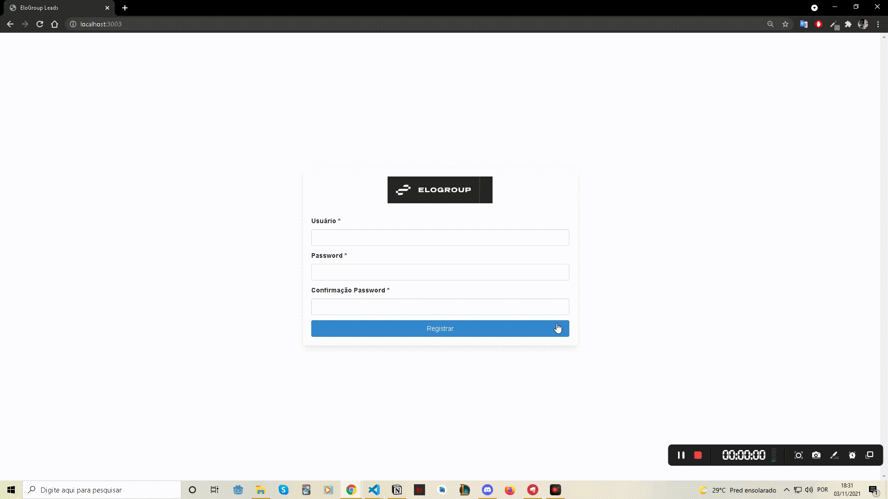

<h1 align="center">
  ELOGROUP Challenge
</h1>

<h3 align="center">
  Sistema de gerenciamento de leads
</h3>

<p align="center">
  <a href="#demonstração">Demonstração</a>&nbsp;&nbsp;&nbsp;|&nbsp;&nbsp;&nbsp;
  <a href="#tecnologias">Tecnologias</a>&nbsp;&nbsp;&nbsp;|&nbsp;&nbsp;&nbsp;
  <a href="#utilização">Utilização</a>&nbsp;&nbsp;&nbsp;
</p>

<br>

## Demonstração

#### Web

<p align="center">
  
</p>

<br>

<p><strong>Observação: </strong>Testado apenas no Google Chrome</p>

<br>

## Tecnologias

### Web

* [React.js](https://reactjs.org/)
* [EditorConfig](https://www.npmjs.com/package/editorconfig)
* [React Router DOM](https://www.npmjs.com/package/react-router-dom)
* [Yup](https://www.npmjs.com/package/yup)
* [Bulma](https://bulma.io/documentation/)
* [RBX](https://dfee.github.io/rbx/)
* [React DnD](https://react-dnd.github.io/react-dnd/about)
* [React Hook Form](https://react-hook-form.com/get-started)
* [Sass](https://sass-lang.com/documentation)


## Utilização

Após baixar o projeto pelo **git clone**, realize os seguintes passos:

### Web

1. Execute os comandos abaixo:

```console
yarn install
yarn start
```
